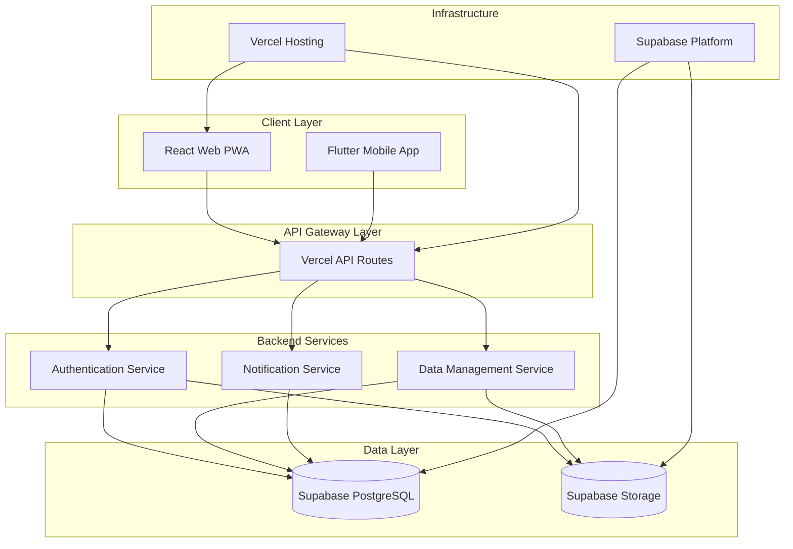

# WADA BMAD Fullstack Architecture Document

## 1. High-Level System Architecture Diagram

This diagram illustrates the dual-platform architecture where both React Web PWA and Flutter mobile applications share the same API layer hosted on Vercel, with Supabase handling data storage and backend services.

## 2. Bounded Contexts and Domain Decomposition

The system is decomposed into the following bounded contexts:

1. **Identity and Authentication**
   - User registration and login
   - Role-based access control (RBAC)
   - Profile management

2. **Data Management**
   - CRUD operations for BMAD-related data
   - Data validation and processing
   - Search and filtering capabilities

3. **Notification System**
   - Push notifications for mobile
   - Email notifications
   - In-app notifications

4. **Reporting and Analytics**
   - Data aggregation and reporting
   - Performance metrics
   - Audit logging

5. **Administration**
   - System configuration
   - User management
   - Monitoring dashboards

## 3. Technology Stack Details

### Frontend
- **React Web PWA**: React 18 with TypeScript, Next.js for SSR/SSG
- **Flutter Mobile**: Flutter with Dart, targeting iOS and Android
- **State Management**: Zustand for React, Provider for Flutter
- **UI Libraries**: Material-UI for React, Flutter Material Components

### Backend
- **API Layer**: Vercel API Routes (Node.js with Express-like routing)
- **Database**: Supabase PostgreSQL
- **Authentication**: Supabase Auth with JWT tokens
- **Real-time**: Supabase Realtime for live updates

### Infrastructure
- **Hosting**: Vercel for frontend and serverless functions
- **Database Hosting**: Supabase (PostgreSQL + extensions)
- **Storage**: Supabase Storage for files and media
- **CDN**: Vercel's global CDN

### Development Tools
- **Version Control**: Git with GitHub
- **CI/CD**: Vercel deployments, GitHub Actions
- **Testing**: Jest for React, Flutter test for mobile
- **Linting**: ESLint for JS/TS, Flutter analyze

## 4. API Design and Communication Patterns

### RESTful API Design
- RESTful endpoints with JSON responses
- Versioned APIs (e.g., `/api/v1/`)
- Consistent error response format

### Key Endpoints
- `POST /api/auth/login` - User authentication
- `GET /api/data/records` - Fetch BMAD records
- `POST /api/data/records` - Create new record
- `PUT /api/data/records/:id` - Update record
- `DELETE /api/data/records/:id` - Delete record

### Communication Patterns
- **Client to API**: HTTP/HTTPS with JWT authentication
- **API to Database**: Direct SQL queries via Supabase client
- **Real-time Updates**: WebSocket connections via Supabase Realtime
- **File Uploads**: Multipart form data to Supabase Storage

### API Security
- JWT tokens for authentication
- CORS configuration for cross-origin requests
- Rate limiting on API routes
- Input validation using Zod schemas

## 5. Data Architecture and Storage

### Database Schema
- **Users Table**: User profiles, roles, preferences
- **Records Table**: BMAD data entries with metadata
- **Notifications Table**: Notification history and status
- **Audit Table**: Change logs for compliance

### Data Relationships
- One-to-many: Users to Records
- Many-to-many: Records to Tags/Categories
- Hierarchical: Organizational structure for multi-tenant setup

### Storage Strategy
- **Structured Data**: PostgreSQL via Supabase
- **Unstructured Data**: Supabase Storage buckets
- **Caching**: Redis (if needed) or in-memory caching
- **Backup**: Automated Supabase backups

### Data Migration
- Supabase migrations for schema changes
- Seed scripts for initial data
- Rollback strategies for failed migrations

## 6. Security Architecture

### Authentication & Authorization
- Supabase Auth for user management
- JWT tokens with expiration
- Role-based permissions (Admin, User, Viewer)
- Multi-factor authentication (MFA) support

### Data Protection
- Encryption at rest (Supabase handles this)
- HTTPS for all communications
- API key management for third-party integrations
- GDPR compliance for data handling

### Security Measures
- Input sanitization and validation
- SQL injection prevention via parameterized queries
- XSS protection in React/Flutter apps
- CSRF protection on forms

### Compliance
- WADA-specific data handling requirements
- Audit trails for all data modifications
- Data retention policies
- Regular security audits

## 7. Deployment and Infrastructure

### Vercel Deployment
- **Frontend**: Automatic deployments from GitHub
- **API Routes**: Serverless functions with auto-scaling
- **Environment Variables**: Secure env var management
- **Custom Domains**: Domain configuration for production

### Supabase Infrastructure
- **Database**: Managed PostgreSQL with high availability
- **Storage**: Global CDN for file serving
- **Edge Functions**: Serverless compute close to users
- **Real-time**: WebSocket connections for live features

### CI/CD Pipeline
- GitHub Actions for automated testing
- Vercel previews for pull request deployments
- Staging environment mirroring production
- Blue-green deployments for zero-downtime updates

### Environment Management
- **Development**: Local Supabase instance
- **Staging**: Separate Supabase project
- **Production**: Production Supabase project with backups

## 8. Monitoring and Observability

### Application Monitoring
- Vercel Analytics for performance metrics
- Supabase dashboard for database health
- Custom logging with structured JSON logs

### Error Tracking
- Sentry integration for error reporting
- Alerting on critical errors
- Error aggregation and analysis

### Performance Monitoring
- Response time tracking
- Database query performance
- User interaction analytics

### Logging Strategy
- Structured logging with log levels
- Centralized log aggregation
- Retention policies for logs

## 9. Error Handling Strategies

### Client-Side Error Handling
- Graceful degradation in React PWA
- Error boundaries in React components
- Try-catch blocks in Flutter widgets
- User-friendly error messages

### API Error Handling
- Consistent error response format
- HTTP status codes (400, 401, 500, etc.)
- Detailed error logging on server
- Retry mechanisms for transient failures

### Database Error Handling
- Transaction rollbacks on failures
- Connection pooling and timeout handling
- Data validation before insertion
- Conflict resolution strategies

### Recovery Strategies
- Circuit breaker pattern for external services
- Fallback mechanisms for critical features
- Automated retry with exponential backoff

## 10. Testing Strategy

### Unit Testing
- Jest for React components and utilities
- Flutter test for mobile widgets and logic
- Supertest for API route testing
- Database mock libraries for isolated testing

### Integration Testing
- End-to-end API testing with Supertest
- Database integration tests
- Cross-platform compatibility testing

### E2E Testing
- Cypress for React PWA
- Flutter integration tests for mobile
- Automated browser testing

### Test Coverage
- Minimum 80% code coverage
- Coverage reports in CI/CD
- Branch coverage for critical paths

## 11. Coding Standards and Best Practices

### Code Style
- ESLint and Prettier for JavaScript/TypeScript
- Flutter's dartfmt for Dart code
- Consistent naming conventions (camelCase, PascalCase)
- Maximum line length of 100 characters

### Code Organization
- Feature-based folder structure
- Separation of concerns (components, services, utils)
- Shared code in common libraries
- Clear import/export patterns

### Documentation
- JSDoc comments for functions
- README files for modules
- API documentation with OpenAPI specs
- Code comments for complex logic only

### Code Reviews
- Pull request templates
- Automated code quality checks
- Peer reviews for all changes
- Approval requirements for critical changes

## 12. Performance Considerations

### Frontend Optimization
- Code splitting in React with dynamic imports
- Image optimization and lazy loading
- Service worker for PWA caching
- Bundle size monitoring

### API Performance
- Database query optimization
- Caching strategies (Redis if needed)
- Pagination for large datasets
- Compression for responses

### Mobile Performance
- Efficient state management in Flutter
- Native performance for animations
- Battery-conscious background tasks
- Offline data synchronization

### Database Performance
- Indexing on frequently queried columns
- Query optimization and EXPLAIN plans
- Connection pooling
- Read replicas for heavy read loads

## 13. Scalability Plans

### Horizontal Scaling
- Vercel serverless functions auto-scale
- Supabase database scaling options
- Load balancing for high traffic

### Vertical Scaling
- Database instance upgrades
- Increased memory for compute resources
- CDN expansion for global reach

### Microservices Evolution
- Potential split of monolithic API into microservices
- Event-driven architecture with message queues
- Service mesh for inter-service communication

### Future Considerations
- Multi-region deployment
- Edge computing for low-latency
- AI/ML integration for data analysis
- Third-party integrations expansion

## Key Architectural Decisions and Rationale

1. **Dual-Platform with Shared APIs**: Allows code reuse and consistent functionality across web and mobile while leveraging platform-specific strengths.

2. **Vercel + Supabase**: Serverless architecture reduces operational overhead, auto-scaling handles traffic spikes, and managed services accelerate development.

3. **Supabase for Backend**: Provides authentication, database, and real-time features out-of-the-box, reducing custom backend development time.

4. **PWA for Web**: Enables offline functionality and app-like experience without app store dependencies.

5. **RESTful APIs**: Simple, widely understood pattern that works well with HTTP and is easy to consume from both React and Flutter.

6. **JWT Authentication**: Stateless authentication that works seamlessly with serverless functions and mobile apps.

7. **PostgreSQL**: Robust, ACID-compliant database suitable for complex queries and data integrity requirements in BMAD context.

This architecture provides a solid foundation for the WADA BMAD project, balancing development speed, maintainability, and scalability while meeting the requirements of a dual-platform application.